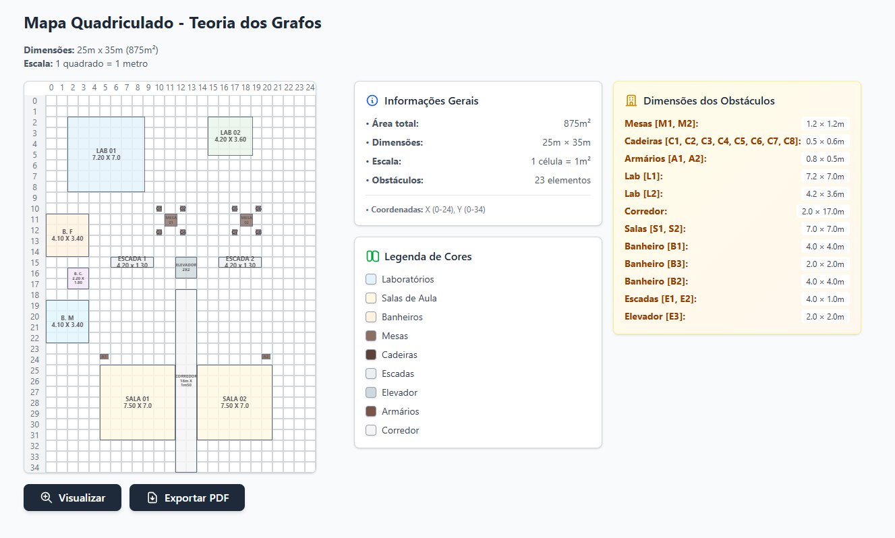

# 🗺️ Planejamento de Rotas com Grafos de Visibilidade

## 📋 Sobre o Projeto

Este projeto academico foi desenvolvido como parte do **Trabalho T3** da disciplina de **Teoria dos Grafos 2025.1**. O objetivo é explorar e aplicar conceitos de teoria dos grafos no planejamento de rotas utilizando **Grafos de Visibilidade** em um ambiente de 875m² (25m × 35m) contendo diversos obstáculos.

## 📸 Preview do Projeto
🔗 **[Ver Projeto Online](https://rota-grafos-visibilidade.vercel.app/)**

*Acesse a aplicação em funcionamento para explorar o ambiente interativo*



*Visualização do ambiente 25m × 35m com obstáculos mapeados*

## 🎯 Objetivo

Desenvolver uma solução algorítmica baseada em Teoria dos Grafos que permita obter uma rota otimizada entre dois pontos em um ambiente com obstáculos, aplicando heurísticas vistas na disciplina.

## 🏗️ Estrutura do Ambiente

O ambiente modelado possui **875m²** (25m × 35m) e contém os seguintes obstáculos:

### 🚪 Espaços Fechados
- **L1, L2**: Dois laboratórios com portas de entrada

### 🪑 Mobiliário
- **M1, M2**: Duas mesas quadradas
- **C1-C8**: Oito cadeiras (4 por mesa)
- **A1, A2**: Dois armários de suporte

### 🏢 Infraestrutura
- **Corredor**: Com acesso a duas salas de aula
- **S1, S2**: Duas salas de aula
- **B1, B2, B3**: Três banheiros (feminino, masculino e cadeirantes)
- **E1, E2**: Duas escadas
- **E3**: Um elevador

## 🛠️ Tecnologias Utilizadas

- **React 19.1.0** - Framework frontend
- **TypeScript** - Tipagem estática
- **Vite** - Build tool e dev server
- **Tailwind CSS** - Framework de CSS
- **jsPDF** - Geração de documentos PDF
- **html2canvas** - Captura de elementos HTML

## 📁 Estrutura do Projeto

```
src/
├── components/
│   └── GridViewModal.tsx      # Modal para visualização do grid
├── config/
│   └── values.ts             # Configurações e dimensões dos obstáculos
├── utils/
│   └── pdfExport.tsx         # Utilitário para exportação PDF
├── App.tsx                   # Componente principal
├── main.tsx                  # Ponto de entrada da aplicação
└── index.css                 # Estilos globais
```

## 🚀 Como Executar

### Pré-requisitos
- Node.js (versão 22.16 ou superior)
- npm ou yarn

### Instalação
```bash
# Clone o repositório
git clone https://github.com/FelipeFMedeiros/Rota-GrafosVisibilidade

# Entre no diretório do projeto
cd Rota-GrafosVisibilidade

# Instale as dependências
npm install

# Execute o projeto em modo de desenvolvimento
npm run dev
```

### Scripts Disponíveis
- `npm run dev` - Executa o projeto em modo de desenvolvimento
- `npm run build` - Gera build de produção
- `npm run preview` - Visualiza o build de produção
- `npm run lint` - Executa verificação de código

## 📊 Funcionalidades Implementadas

### ✅ Fase Atual - Visualização do Grid
- [x] Mapeamento inicial do ambiente 25m × 35m
- [x] Visualização interativa do grid
- [x] Sistema de zoom e navegação
- [x] Exportação para PDF
- [x] Configuração de obstáculos

### 🔄 Próximas Implementações
- [ ] Identificação de coordenadas dos obstáculos
- [ ] Definição de pontos inicial (i) e final (j)
- [ ] Construção do Grafo de Visibilidade
- [ ] Implementação de algoritmo de roteamento
- [ ] Visualização da rota gerada

## 📈 Etapas do Desenvolvimento

### 1️⃣ Mapeamento Inicial
- Representação do ambiente com obstáculos
- Definição das dimensões de cada elemento
- Modelagem em escala 1:1 (1 quadrado = 1 metro)

### 2️⃣ Modelagem do Grafo
- Criação do grafo de visibilidade
- Conexão de vértices com arestas ponderadas (distância euclidiana)
- Definição dos pontos de origem e destino

### 3️⃣ Configuração Final
- Aplicação de heurística para encontrar rota ótima
- Representação visual da rota no grafo
- Validação de ausência de colisões

### 4️⃣ Algoritmos Planejados
- **Dijkstra**: Para encontrar o caminho mais curto
- **A***: Heurística com função de custo
- **Algoritmos de Visibilidade**: Para construção do grafo

## 🎮 Controles da Aplicação

### Visualização
- **Scroll**: Navegação pelo grid
- **Ctrl + Scroll**: Zoom in/out
- **Botões de Zoom**: Controle preciso do zoom
- **Arrastar**: Navegação por pan quando em zoom

### Exportação
- **Botão Exportar PDF**: Gera documento PDF do grid atual

## 📐 Especificações Técnicas

### Dimensões do Ambiente
- **Largura**: 25 metros
- **Altura**: 35 metros
- **Área Total**: 875m²
- **Escala**: 1 quadrado = 1 metro

### Configuração do Grid
- **Resolução**: 25×35 células
- **Tamanho da Célula**: 20px (para renderização)
- **Sistema de Coordenadas**: (0,0) no canto superior esquerdo

## 👥 Autor(es)

- **[Felipe Freitas](https://github.com/FelipeFMedeiros)**
- **[Maria Eduarda](https://github.com/dudarocha81)**

---

**Teoria dos Grafos 2025.1** - Trabalho T3  
*Planejamento de Rotas com Grafos de Visibilidade*